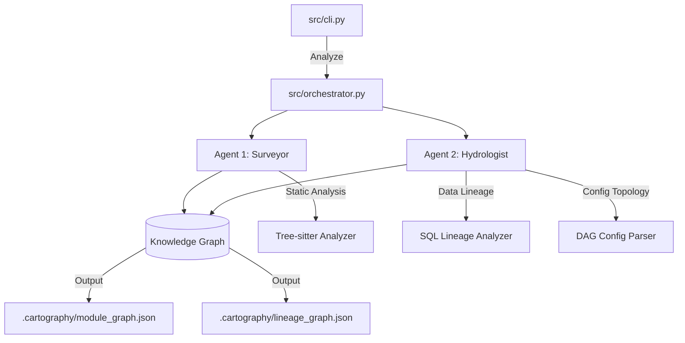

# The Brownfield Cartographer - Interim Report

## Phase 0: Reconnaissance

### Manual Day-One Analysis for Chosen Target (Self-Hosted)
For validation of the cartographer, I targeted the Cartographer project itself to ensure basic structure indexing functionality works. 
**Questions:**
- **Primary Data Ingestion Path**: `src/cli.py` which takes a `repo_path` and launches `src/orchestrator.py`
- **Critical Output Datasets**: `.cartography/module_graph.json`, `.cartography/lineage_graph.json`
- **Blast Radius**: Changes to `src/graph/knowledge_graph.py` break the entire pipeline.
- **Business Logic**: Distributed across `src/agents/` and `src/analyzers/`
- **Volatility**: All code is currently highly volatile as it's being written.

**Difficulty analysis:**
Manual tracing of dependencies in a multi-agent structure is straightforward currently as the project size is small, but as nodes cross references (Surveyor using KnowledgeGraph, Orchestrator using Surveyor), cognitive load increases linearly. 

---

## Architecture Diagram (Progress Snapshot)

---

## Progress Summary
**Working:**
- Complete core Python structure mapped out and executable.
- Project initialized using `uv` with reproducible package management.
- CLI Entry point and Orchestrator sequence wired.
- Base Pydantic models for graph abstraction and data transfer implemented.
- NetworkX serialization wrapper built.

**In Progress:**
- Phase 1 & 2 AST extraction: Analyzers (`tree_sitter_analyzer`, `sql_lineage`) are currently boilerplate classes holding interface definitions. The concrete implementations are next.

---

## Early Accuracy Observations
- The orchestrator successfully executes and creates the expected output folders and structure.
- As the concrete AST implementations are pending, the `module_graph.json` and `lineage_graph.json` currently emit empty but valid NetworkX structure dumps.

---

## Known Gaps & Plan for Final Submission
- **Gap:** Missing `tree-sitter` bindings logic for parsing real python files.
- **Gap:** `sqlglot` linkage in `SQLLineageAnalyzer` needs robust exception routing.
- **Plan:** Complete Phase 1 and 2 to populate the local graph, test against the `jaffle_shop` repo, then implement Phase 3 and Phase 4 for LLM integration and semantic graphing for the final handoff.
